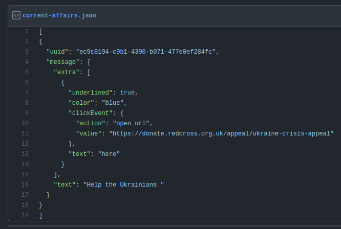
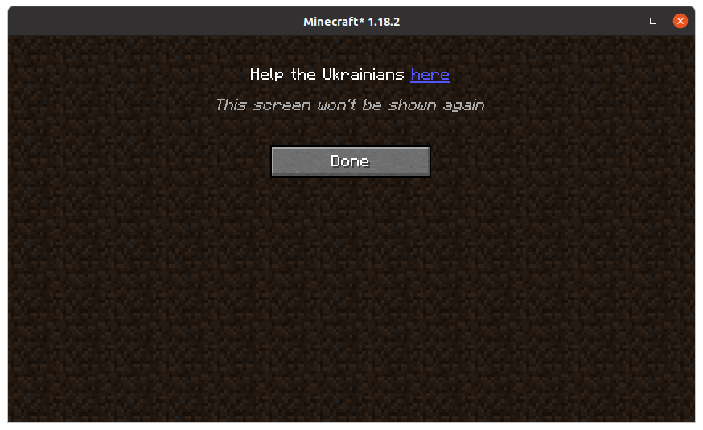

# Current Affairs

This mod is a library that can be included by other mods for their authors to send important messages about current affairs to their users. With minimal effort!

## Why use this library?

- Each message is only ever displayed to users once, when the game starts up, to minimize intrusiveness.
- Messages are stored in a json file on the web, so you don't need to push out an update to your mod for users to receive an important message.
- Includes a system for preventing users getting similar messages from multiple mod authors, to minimize intrusiveness.





## How to use this library

The first step is to jar-in-jar this mod into your mod. This is pretty simple to do in your build.gradle:
```groovy
repositories {
    mavenCentral()
}
dependencies {
    include("net.earthcomputer.currentaffairs:currentaffairs:${project.currentAffairsVersion}")
}
```

Next, you need to specify the URL that the mod should collect messages from. Add this to your `fabric.mod.json` file:
```json5
{
  // ...
  "custom": {
    "current-affairs": "https://mywebsite.com/current-affairs.json"
  }
}
```
Of course, this can point to any json file on the internet, including e.g. a raw GitHub Gist.

Lastly, you have to actually create this json file. The json has the following structure. You can find an example in the image above.
- List of current affairs (json list)
  - A current affair (json object)
    - `uuid` (string, required): an ID for the general theme of the message. Once the user has seen a message with this ID, the user cannot see any message with the same ID in the future. If you know another mod author is trying to push a similar message to you, try to use the same ID as them so that users don't get the same message twice.
    - `message` ([Text](https://minecraft.fandom.com/wiki/Raw_JSON_text_format), required): the message to display to the user. This is a Minecraft text component object, which allows you to include style, hover events and click events.
    - `locale` (string, optional): restrict this message to only be displayed to users with the given locale. If this string contains a `-`, then it is in the format `aa-BB` where `aa` is the ISO 639 alpha-2 or alpha-3 language code and `BB` is the ISO 3166 alpha-2 country code or the UN M.49 numeric-3 area code. If the locale does not contain a `-`, then it is simply the country code (not the language code) on its own.
    - `from` (string, optional): an ISO 8601 formatted date-time. The message will not be displayed before this time.
    - `expire` (string, optional): an ISO 8601 formatted date-time. The message will not be displayed after this time. It is good practice to set this in case you're not around to remove the message later.
